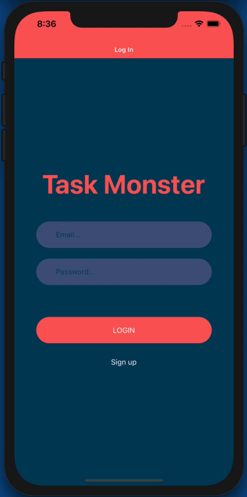
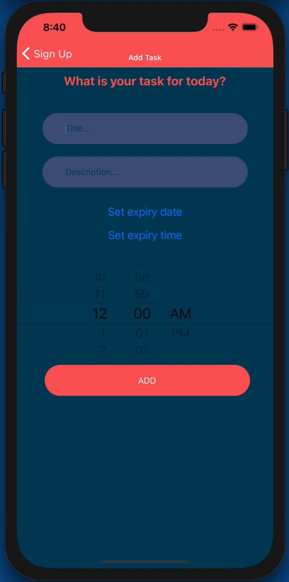
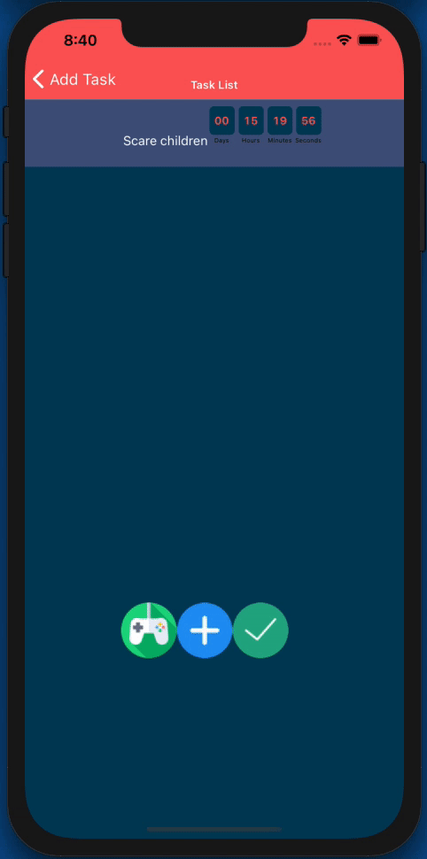
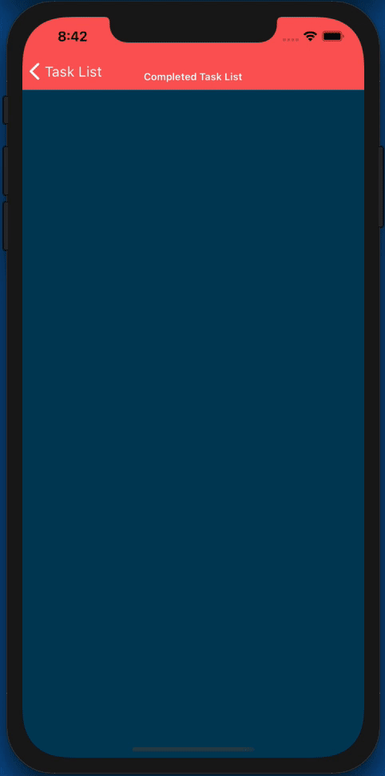
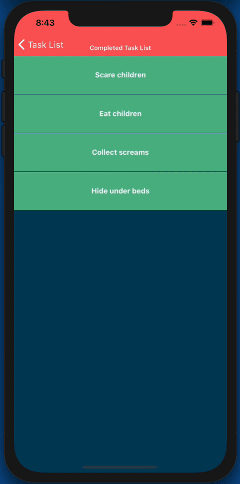
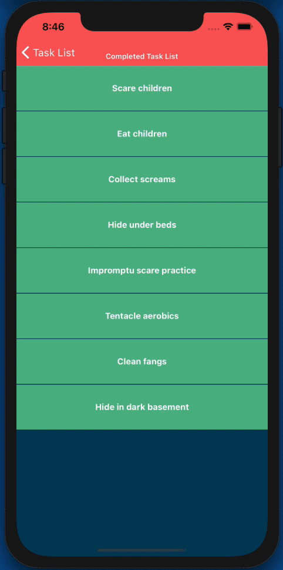
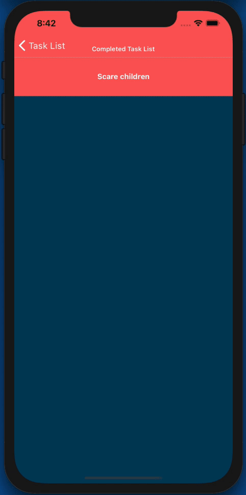
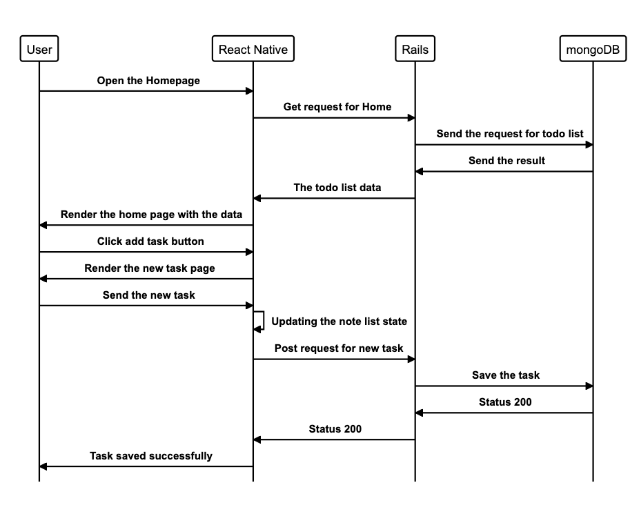
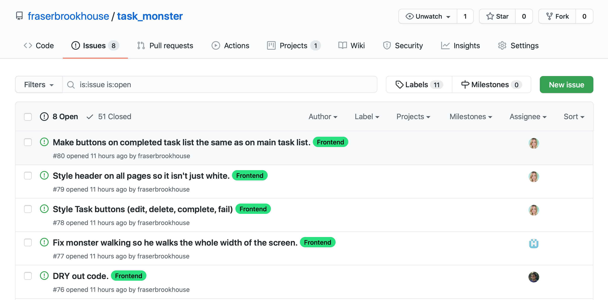

# Task Monster

## Description

A task manager app for people who want keep track of what they need to do, be rewarded when they complete tasks, and punished when they don't.

Completing tasks will grow and evolve your pet, failing to do so will shrink and eventually kill it. Laziness and procrastination now has consequences!

## App Demo

<div class="gifs">





</div>

## Technologies Used
* Expo - Front End
* React Native - Front End
* React Native Game Engine - Front End
* Matter.js - Front End
* Ruby on Rails - Back End
* MongoDB - Database

## The team
[Fraser Brookhouse](https://github.com/fraserbrookhouse)

[Iliyan Yankov](https://github.com/Iliyan-Y)

[Kristyna Cervenkova](https://github.com/kristycer)

## How to Run the App

* First Fork/Clone this repo.

### Backend

Our backend is currently hosted at 


## User Stories


### MVP
```
As a User,
So I only see my tasks,
I would like to be able to create an account.
```

```
As a User,
So Only I can see my tasks,
I would like to have to log in to see my task list.
```

```
As a User,
So I can keep track of my tasks,
I want to to be able to make add an item to a ToDo list.
```

```
As a User,
So I know what I need to do,
I want to see a list of tasks.
```

```
As a User,
So I can keep my tasks organised,
I would like to be able to mark a task as complete.
```

```
As a User,
So I can keep tasks up to date as things change,
I would like to be able to edit tasks.
```

```
As a User,
So I can keep tasks up to date as things change,
I would like to be able to delete tasks.
```

### Extra Features

```
As a User,
So I can keep my tasks organised,
I would like to be able to have multiple lists.
```

```
As a User,
So I can stay motivated,
I would like my completed tasks to grow my creature.
```

```
As a User,
To encourage me to complete as many tasks as I can,
I would like my creature to evolve if I complete many tasks.
```

```
As a User,
To encourage me to complete my tasks on time,
I would like my creature to shrink if I fail to complete a task.
```

```
As a User,
To encourage me to not be lazy for too long,
If I fail to complete a number of tasks in a row, I would like my creature to die.
```

```
As a User,
So I don't forget to complete tasks,
I would like to be reminded about tasks that have been uncompleted for a long time.
```

### Bonus Features

```
As a User,
So I can be reminded to do tasks at the correct location,
I would like to set a location to be reminded to do a task.
```

```
As a User,
So I can complete my tasks in a timely fashion,
I would like to set a deadline for my tasks to be completed by.
```

```
As a User,
So I can have more control over my creature,
I would like my completed tasks to award money I can spend on it.
```

```
As a User,
So I can personalise my creature,
I would like to have a number of option for items to spend my money on.
```

## Diagrams


