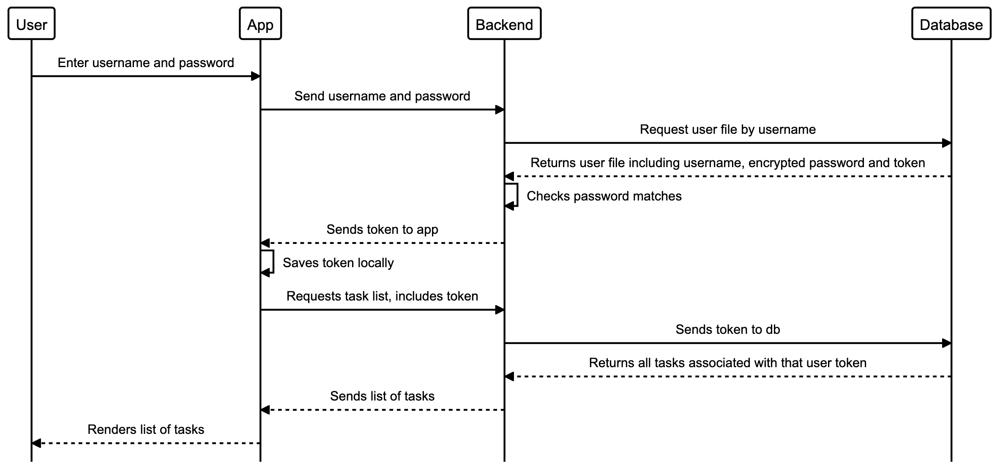

# Task Monster

## Description

A task manager app for people who want keep track of what they need to do, be rewarded when they complete tasks, and punished when they don't.

Completing tasks will grow and evolve your pet, failing to do so will shrink and eventually kill it. Laziness and procrastination now has consequences!

## App Demo

<div class="gifs">


</div>

## Technologies Used
* Expo - Front End
* React Native - Front End
* React Native Game Engine - Front End
* Matter.js - Front End
* Ruby on Rails - Back End
* MongoDB - Database

## The team
[Fraser Brookhouse](https://github.com/fraserbrookhouse)

[Iliyan Yankov](https://github.com/Iliyan-Y)

[Kristyna Cervenkova](https://github.com/kristycer)

## Wiki

[Here is our wiki. It contains our user stories and group manifesto.](https://github.com/fraserbrookhouse/task_monster/wiki)

## How to Run the App

* First Fork/Clone this repo.

### Backend

Our backend is currently hosted [here](https://task-monster-backend.herokuapp.com).

### Frontend

In your terminal, navigate to the repo.

Once there 'cd frontend'.

In the front end folder run these commands in order:

```
'npm install' //to install the node packages.

'expo install' //to install the yarn packages.

'expo start' //to run the app.
```

This will open a browser window where you can choose to run in either an ios or android simulator.

## Diagrams

#### App Overview Sequence Diagram


#### Token Authentication Sequence Diagram
